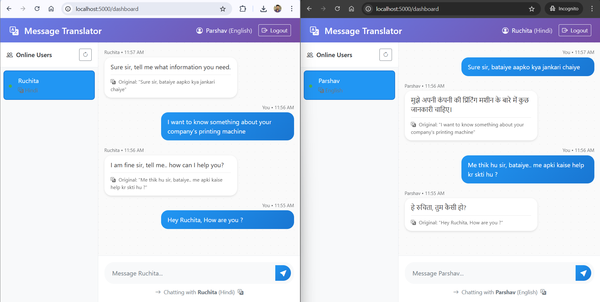

# 🌐 Multilingual Messaging App (Node.js + OpenAI)

A full-stack messaging application where users can log in with their name and preferred language, view all active users, send messages in their own language, and receive translated responses—all powered by the OpenAI API.



---

## 🛠 Tech Stack

- **Backend**: Node.js, Express.js
- **Database**: SQLite3
- **Frontend**: EJS, Bootstrap 5
- **Translation**: OpenAI API
- **Architecture**: API-based (no real-time sockets)

---

## 🚀 Features

- ✅ Login with name and preferred language (no password)
- ✅ View all active/live users
- ✅ Send messages to any live user
- ✅ Automatic message translation using OpenAI
- ✅ Receive both original and translated message
- ✅ Fully REST API-based (no WebSockets or real-time communication)
- ✅ Manual logout (removes user from live list/database)
- ✅ Auto-logout after 1 hour of inactivity (no messaging)

---

## 🔧 Setup Instructions

### 1. Clone the Repository

```bash
git clone https://github.com/your-username/multilingual-messaging-app.git
cd multilingual-messaging-app
````

### 2. Install Dependencies

```bash
npm install
```

### 3. Configure OpenAI API Key

Create a `.env` file and add your OpenAI key:

```
OPENAI_API_KEY=your_openai_key_here
```

### 4. Run the App

```bash
npm start
```

App will be available at `http://localhost:3000`

---

## 📄 License

MIT License © 2025 Parshav Shah
